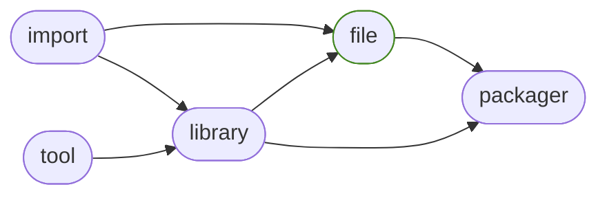

<h1>generalfile</h1>

Easily manage files cross platform.

<h2>Table of Contents</h2>

<pre>
<a href='#generalfile'>generalfile</a>
├─ <a href='#Dependency-Diagram-for-ManderaGeneral'>Dependency Diagram for ManderaGeneral</a>
├─ <a href='#Installation-showing-dependencies'>Installation showing dependencies</a>
├─ <a href='#Information'>Information</a>
├─ <a href='#Attributes'>Attributes</a>
├─ <a href='#Contributions'>Contributions</a>
└─ <a href='#Todo'>Todo</a>
</pre>

<h2>Dependency Diagram for ManderaGeneral</h2>

<h2>Installation showing dependencies</h2>

| `pip install`                                                        | `generalfile`   | `generalfile[spreadsheet]`   | `generalfile[full]`   |
|:---------------------------------------------------------------------|:----------------|:-----------------------------|:----------------------|
| <a href='https://pypi.org/project/generalimport'>generalimport</a>   | ✔️              | ✔️                           | ✔️                    |
| <a href='https://pypi.org/project/generallibrary'>generallibrary</a> | ✔️              | ✔️                           | ✔️                    |
| <a href='https://pypi.org/project/send2trash'>send2trash</a>         | ✔️              | ✔️                           | ✔️                    |
| <a href='https://pypi.org/project/appdirs'>appdirs</a>               | ✔️              | ✔️                           | ✔️                    |
| <a href='https://pypi.org/project/dill'>dill</a>                     | ✔️              | ✔️                           | ✔️                    |
| <a href='https://pypi.org/project/pandas'>pandas</a>                 | ❌               | ✔️                           | ✔️                    |

<h2>Information</h2>

| Package                                                      | Ver                                             | Latest Release       | Python                                                                                                                                                                                                                                                                                                                | Platform        | Cover   |
|:-------------------------------------------------------------|:------------------------------------------------|:---------------------|:----------------------------------------------------------------------------------------------------------------------------------------------------------------------------------------------------------------------------------------------------------------------------------------------------------------------|:----------------|:--------|
| [generalfile](https://github.com/ManderaGeneral/generalfile) | [2.5.17](https://pypi.org/project/generalfile/) | 2024-01-24 07:20 CET | [3.8](https://www.python.org/downloads/release/python-380/), [3.9](https://www.python.org/downloads/release/python-390/), [3.10](https://www.python.org/downloads/release/python-3100/), [3.11](https://www.python.org/downloads/release/python-3110/), [3.12](https://www.python.org/downloads/release/python-3120/) | Windows, Ubuntu | 71.9 %  |

<h2>Attributes</h2>

<pre>
<a href='https://github.com/ManderaGeneral/generalfile/blob/master/generalfile/__init__.py#L1'>Module: generalfile</a>
├─ <a href='https://github.com/ManderaGeneral/generalfile/blob/master/generalfile/errors.py#L6'>Class: CaseSensitivityError</a>
├─ <a href='https://github.com/ManderaGeneral/generalfile/blob/master/generalfile/configfile.py#L111'>Class: ConfigFile</a>
│  ├─ <a href='https://github.com/ManderaGeneral/generalfile/blob/master/generalfile/configfile.py#L141'>Method: exists</a>
│  ├─ <a href='https://github.com/ManderaGeneral/generalfile/blob/master/generalfile/configfile.py#L96'>Method: get_custom_serializers</a>
│  ├─ <a href='https://github.com/ManderaGeneral/generalfile/blob/master/generalfile/configfile.py#L104'>Method: get_field_dict_serializable</a>
│  ├─ <a href='https://github.com/ManderaGeneral/generalfile/blob/master/generalfile/configfile.py#L170'>Method: halt_getattr</a>
│  ├─ <a href='https://github.com/ManderaGeneral/generalfile/blob/master/generalfile/configfile.py#L16'>Method: read_hook_post</a>
│  ├─ <a href='https://github.com/ManderaGeneral/generalfile/blob/master/generalfile/configfile.py#L15'>Method: read_hook_pre</a>
│  ├─ <a href='https://github.com/ManderaGeneral/generalfile/blob/master/generalfile/configfile.py#L150'>Method: safe_equals</a>
│  ├─ <a href='https://github.com/ManderaGeneral/generalfile/blob/master/generalfile/configfile.py#L57'>Method: write_config</a>
│  ├─ <a href='https://github.com/ManderaGeneral/generalfile/blob/master/generalfile/configfile.py#L18'>Method: write_hook_post</a>
│  └─ <a href='https://github.com/ManderaGeneral/generalfile/blob/master/generalfile/configfile.py#L17'>Method: write_hook_pre</a>
├─ <a href='https://github.com/ManderaGeneral/generalfile/blob/master/generalfile/errors.py#L10'>Class: InvalidCharacterError</a>
└─ <a href='https://github.com/ManderaGeneral/generalfile/blob/master/generalfile/path.py#L20'>Class: Path</a>
   ├─ <a href='https://github.com/ManderaGeneral/generalfile/blob/master/generalfile/path.py#L20'>Class: Path</a>
   ├─ <a href='https://github.com/ManderaGeneral/generalfile/blob/master/generalfile/path_bases/path_strings.py#L32'>Method: absolute</a>
   ├─ <a href='https://github.com/ManderaGeneral/generalfile/blob/master/generalfile/path_bases/path_operations.py#L91'>Method: as_renamed</a>
   ├─ <a href='https://github.com/ManderaGeneral/generalfile/blob/master/generalfile/path_bases/path_operations.py#L291'>Method: as_working_dir</a>
   ├─ <a href='https://github.com/ManderaGeneral/generalfile/blob/master/generalfile/optional_dependencies/path_cfg.py#L13'>Property: cfg</a>
   ├─ <a href='https://github.com/ManderaGeneral/generalfile/blob/master/generalfile/path_bases/path_operations.py#L443'>Method: contains</a>
   ├─ <a href='https://github.com/ManderaGeneral/generalfile/blob/master/generalfile/path_bases/path_operations.py#L104'>Method: copy</a>
   ├─ <a href='https://github.com/ManderaGeneral/generalfile/blob/master/generalfile/path_bases/path_operations.py#L168'>Method: copy_to_folder</a>
   ├─ <a href='https://github.com/ManderaGeneral/generalfile/blob/master/generalfile/path_bases/path_operations.py#L247'>Method: create_folder</a>
   ├─ <a href='https://github.com/ManderaGeneral/generalfile/blob/master/generalfile/path_bases/path_operations.py#L331'>Method: delete</a>
   ├─ <a href='https://github.com/ManderaGeneral/generalfile/blob/master/generalfile/path_bases/path_operations.py#L363'>Method: delete_folder_content</a>
   ├─ <a href='https://github.com/ManderaGeneral/generalfile/blob/master/generalfile/path_bases/path_operations.py#L226'>Method: empty</a>
   ├─ <a href='https://github.com/ManderaGeneral/generalfile/blob/master/generalfile/path_bases/path_strings.py#L280'>Method: encode</a>
   ├─ <a href='https://github.com/ManderaGeneral/generalfile/blob/master/generalfile/path_bases/path_strings.py#L94'>Method: endswith</a>
   ├─ <a href='https://github.com/ManderaGeneral/generalfile/blob/master/generalfile/path_bases/path_strings.py#L287'>Method: escaped</a>
   ├─ <a href='https://github.com/ManderaGeneral/generalfile/blob/master/generalfile/path_bases/path_operations.py#L214'>Method: exists</a>
   ├─ <a href='https://github.com/ManderaGeneral/generalfile/blob/master/generalfile/path_bases/path_strings.py#L273'>Method: forward_slash</a>
   ├─ <a href='https://github.com/ManderaGeneral/generalfile/blob/master/generalfile/path_bases/path_strings.py#L24'>Method: from_alternative</a>
   ├─ <a href='https://github.com/ManderaGeneral/generalfile/blob/master/generalfile/path_bases/path_envs.py#L40'>Method: get_active_venv_path</a>
   ├─ <a href='https://github.com/ManderaGeneral/generalfile/blob/master/generalfile/path_bases/path_operations.py#L303'>Method: get_cache_dir</a>
   ├─ <a href='https://github.com/ManderaGeneral/generalfile/blob/master/generalfile/path_bases/path_operations.py#L416'>Method: get_differing_files</a>
   ├─ <a href='https://github.com/ManderaGeneral/generalfile/blob/master/generalfile/path_bases/path_operations.py#L313'>Method: get_lock_dir</a>
   ├─ <a href='https://github.com/ManderaGeneral/generalfile/blob/master/generalfile/path_bases/path_operations.py#L322'>Method: get_lock_path</a>
   ├─ <a href='https://github.com/ManderaGeneral/generalfile/blob/master/generalfile/path_bases/path_envs.py#L25'>Method: get_parent_package</a>
   ├─ <a href='https://github.com/ManderaGeneral/generalfile/blob/master/generalfile/path_bases/path_envs.py#L32'>Method: get_parent_repo</a>
   ├─ <a href='https://github.com/ManderaGeneral/generalfile/blob/master/generalfile/path_bases/path_envs.py#L18'>Method: get_parent_venv</a>
   ├─ <a href='https://github.com/ManderaGeneral/generalfile/blob/master/generalfile/path_bases/path_operations.py#L265'>Method: get_working_dir</a>
   ├─ <a href='https://github.com/ManderaGeneral/generalfile/blob/master/generalfile/path_bases/path_strings.py#L59'>Method: is_absolute</a>
   ├─ <a href='https://github.com/ManderaGeneral/generalfile/blob/master/generalfile/path_bases/path_operations.py#L184'>Method: is_file</a>
   ├─ <a href='https://github.com/ManderaGeneral/generalfile/blob/master/generalfile/path_bases/path_operations.py#L190'>Method: is_folder</a>
   ├─ <a href='https://github.com/ManderaGeneral/generalfile/blob/master/generalfile/path_bases/path_operations.py#L401'>Method: is_identical</a>
   ├─ <a href='https://github.com/ManderaGeneral/generalfile/blob/master/generalfile/path_bases/path_envs.py#L10'>Method: is_package</a>
   ├─ <a href='https://github.com/ManderaGeneral/generalfile/blob/master/generalfile/path_bases/path_strings.py#L66'>Method: is_relative</a>
   ├─ <a href='https://github.com/ManderaGeneral/generalfile/blob/master/generalfile/path_bases/path_envs.py#L14'>Method: is_repo</a>
   ├─ <a href='https://github.com/ManderaGeneral/generalfile/blob/master/generalfile/path_bases/path_operations.py#L196'>Method: is_root</a>
   ├─ <a href='https://github.com/ManderaGeneral/generalfile/blob/master/generalfile/path_bases/path_envs.py#L6'>Method: is_venv</a>
   ├─ <a href='https://github.com/ManderaGeneral/generalfile/blob/master/generalfile/path_bases/path_lock.py#L113'>Method: lock</a>
   ├─ <a href='https://github.com/ManderaGeneral/generalfile/blob/master/generalfile/path_bases/path_strings.py#L266'>Method: match</a>
   ├─ <a href='https://github.com/ManderaGeneral/generalfile/blob/master/generalfile/path_bases/path_strings.py#L73'>Method: mirror_path</a>
   ├─ <a href='https://github.com/ManderaGeneral/generalfile/blob/master/generalfile/path_bases/path_operations.py#L176'>Method: move</a>
   ├─ <a href='https://github.com/ManderaGeneral/generalfile/blob/master/generalfile/path_bases/path_strings.py#L153'>Method: name</a>
   ├─ <a href='https://github.com/ManderaGeneral/generalfile/blob/master/generalfile/path_bases/path_operations.py#L257'>Method: open_folder</a>
   ├─ <a href='https://github.com/ManderaGeneral/generalfile/blob/master/generalfile/path_bases/path_operations.py#L31'>Method: open_operation</a>
   ├─ <a href='https://github.com/ManderaGeneral/generalfile/blob/master/generalfile/path_bases/path_operations.py#L119'>Method: overwrite_check</a>
   ├─ <a href='https://github.com/ManderaGeneral/generalfile/blob/master/generalfile/path_bases/path_operations.py#L463'>Method: pack</a>
   ├─ <a href='https://github.com/ManderaGeneral/generalfile/blob/master/generalfile/path_bases/path_strings.py#L145'>Method: parts</a>
   ├─ <a href='https://github.com/ManderaGeneral/generalfile/blob/master/generalfile/optional_dependencies/path_pickle.py#L12'>Property: pickle</a>
   ├─ <a href='https://github.com/ManderaGeneral/generalfile/blob/master/generalfile/path_bases/path_operations.py#L64'>Method: read</a>
   ├─ <a href='https://github.com/ManderaGeneral/generalfile/blob/master/generalfile/path_bases/path_strings.py#L42'>Method: relative</a>
   ├─ <a href='https://github.com/ManderaGeneral/generalfile/blob/master/generalfile/path_bases/path_strings.py#L120'>Method: remove_end</a>
   ├─ <a href='https://github.com/ManderaGeneral/generalfile/blob/master/generalfile/path_bases/path_strings.py#L103'>Method: remove_start</a>
   ├─ <a href='https://github.com/ManderaGeneral/generalfile/blob/master/generalfile/path_bases/path_operations.py#L73'>Method: rename</a>
   ├─ <a href='https://github.com/ManderaGeneral/generalfile/blob/master/generalfile/path_bases/path_operations.py#L205'>Method: root</a>
   ├─ <a href='https://github.com/ManderaGeneral/generalfile/blob/master/generalfile/path_bases/path_strings.py#L136'>Method: same_destination</a>
   ├─ <a href='https://github.com/ManderaGeneral/generalfile/blob/master/generalfile/path_bases/path_scrub.py#L10'>Method: scrub</a>
   ├─ <a href='https://github.com/ManderaGeneral/generalfile/blob/master/generalfile/path_bases/path_operations.py#L380'>Method: seconds_since_creation</a>
   ├─ <a href='https://github.com/ManderaGeneral/generalfile/blob/master/generalfile/path_bases/path_operations.py#L388'>Method: seconds_since_modified</a>
   ├─ <a href='https://github.com/ManderaGeneral/generalfile/blob/master/generalfile/path_bases/path_operations.py#L282'>Method: set_working_dir</a>
   ├─ <a href='https://github.com/ManderaGeneral/generalfile/blob/master/generalfile/path_bases/path_operations.py#L395'>Method: size</a>
   ├─ <a href='https://github.com/ManderaGeneral/generalfile/blob/master/generalfile/path_bases/path_diagram.py#L20'>Method: spawn_children</a>
   ├─ <a href='https://github.com/ManderaGeneral/generalfile/blob/master/generalfile/path_bases/path_diagram.py#L11'>Method: spawn_parents</a>
   ├─ <a href='https://github.com/ManderaGeneral/generalfile/blob/master/generalfile/optional_dependencies/path_spreadsheet.py#L14'>Property: spreadsheet</a>
   ├─ <a href='https://github.com/ManderaGeneral/generalfile/blob/master/generalfile/path_bases/path_strings.py#L85'>Method: startswith</a>
   ├─ <a href='https://github.com/ManderaGeneral/generalfile/blob/master/generalfile/path_bases/path_strings.py#L170'>Method: stem</a>
   ├─ <a href='https://github.com/ManderaGeneral/generalfile/blob/master/generalfile/path_bases/path_strings.py#L204'>Method: suffix</a>
   ├─ <a href='https://github.com/ManderaGeneral/generalfile/blob/master/generalfile/path_bases/path_strings.py#L249'>Method: suffixes</a>
   ├─ <a href='https://github.com/ManderaGeneral/generalfile/blob/master/generalfile/optional_dependencies/path_text.py#L12'>Property: text</a>
   ├─ <a href='https://github.com/ManderaGeneral/generalfile/blob/master/generalfile/path_bases/path_strings.py#L16'>Method: to_alternative</a>
   ├─ <a href='https://github.com/ManderaGeneral/generalfile/blob/master/generalfile/path_bases/path_operations.py#L352'>Method: trash</a>
   ├─ <a href='https://github.com/ManderaGeneral/generalfile/blob/master/generalfile/path_bases/path_operations.py#L372'>Method: trash_folder_content</a>
   ├─ <a href='https://github.com/ManderaGeneral/generalfile/blob/master/generalfile/path_bases/path_strings.py#L187'>Method: true_stem</a>
   ├─ <a href='https://github.com/ManderaGeneral/generalfile/blob/master/generalfile/path_bases/path_operations.py#L482'>Method: unpack</a>
   ├─ <a href='https://github.com/ManderaGeneral/generalfile/blob/master/generalfile/path_bases/path_diagram.py#L7'>Method: view_paths</a>
   ├─ <a href='https://github.com/ManderaGeneral/generalfile/blob/master/generalfile/path_bases/path_strings.py#L161'>Method: with_name</a>
   ├─ <a href='https://github.com/ManderaGeneral/generalfile/blob/master/generalfile/path_bases/path_strings.py#L178'>Method: with_stem</a>
   ├─ <a href='https://github.com/ManderaGeneral/generalfile/blob/master/generalfile/path_bases/path_strings.py#L213'>Method: with_suffix</a>
   ├─ <a href='https://github.com/ManderaGeneral/generalfile/blob/master/generalfile/path_bases/path_strings.py#L257'>Method: with_suffixes</a>
   ├─ <a href='https://github.com/ManderaGeneral/generalfile/blob/master/generalfile/path_bases/path_strings.py#L195'>Method: with_true_stem</a>
   ├─ <a href='https://github.com/ManderaGeneral/generalfile/blob/master/generalfile/path_bases/path_operations.py#L238'>Method: without_file</a>
   └─ <a href='https://github.com/ManderaGeneral/generalfile/blob/master/generalfile/path_bases/path_operations.py#L51'>Method: write</a>
</pre>

<h2>Contributions</h2>

Issue-creation, discussions and pull requests are most welcome!

<h2>Todo</h2>

| Module                                                                                                                                               | Message                                                                                                                                                                                   |
|:-----------------------------------------------------------------------------------------------------------------------------------------------------|:------------------------------------------------------------------------------------------------------------------------------------------------------------------------------------------|
| <a href='https://github.com/ManderaGeneral/generalfile/blob/master/generalfile/path.py#L1'>path.py</a>                                               | <a href='https://github.com/ManderaGeneral/generalfile/blob/master/generalfile/path.py#L27'>Binary extension.</a>                                                                         |
| <a href='https://github.com/ManderaGeneral/generalfile/blob/master/generalfile/configfile.py#L1'>configfile.py</a>                                   | <a href='https://github.com/ManderaGeneral/generalfile/blob/master/generalfile/configfile.py#L119'>Handle custom serializers within iterable for ConfigFile.</a>                          |
| <a href='https://github.com/ManderaGeneral/generalfile/blob/master/generalfile/optional_dependencies/path_spreadsheet.py#L1'>path_spreadsheet.py</a> | <a href='https://github.com/ManderaGeneral/generalfile/blob/master/generalfile/optional_dependencies/path_spreadsheet.py#L115'>Support DataFrame and Series with spreadsheet.append()</a> |
| <a href='https://github.com/ManderaGeneral/generalfile/blob/master/generalfile/path_bases/path_operations.py#L1'>path_operations.py</a>              | <a href='https://github.com/ManderaGeneral/generalfile/blob/master/generalfile/path_bases/path_operations.py#L449'>Fix contains() using raw open()</a>                                    |
| <a href='https://github.com/ManderaGeneral/generalfile/blob/master/generalfile/path_bases/path_lock.py#L1'>path_lock.py</a>                          | <a href='https://github.com/ManderaGeneral/generalfile/blob/master/generalfile/path_bases/path_lock.py#L11'>Lock the optional extra paths.</a>                                            |

Generated 2024-01-24 07:20 CET for commit <a href='https://github.com/ManderaGeneral/generalfile/commit/master'>master</a>.

