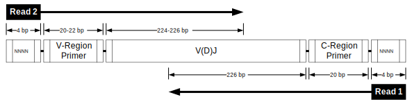
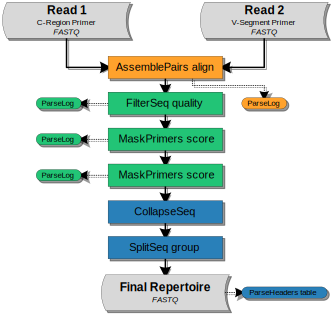

Illumina MiSeq 2x250 BCR mRNA
================================================================================

Overview of Experimental Data
--------------------------------------------------------------------------------

.. include:: ../../examples/Greiff2014/README.rst

Read Configuration
^^^^^^^^^^^^^^^^^^^^^^^^^^^^^^^^^^^^^^^^^^^^^^^^^^^^^^^^^^^^^^^^^^^^^^^^^^^^^^^^

    **Schematic of Illumina MiSeq 2x250 stranded paired-end reads without UMI barcodes.**
    Each 250 base-pair read was sequenced from one end of the target cDNA, so
    that the two reads together cover the entire variable region of the Ig
    heavy chain. The V(D)J reading frame proceeds from the start of read 2 to
    the start of read 1. Read 1 is in the opposite orientation
    (reverse complement), and contains the C-region primer sequence. Both
    reads begin with a random sequences of 4 nucleotides.

Example Data
^^^^^^^^^^^^^^^^^^^^^^^^^^^^^^^^^^^^^^^^^^^^^^^^^^^^^^^^^^^^^^^^^^^^^^^^^^^^^^^^

We have hosted a small subset of the data (Accession: ERR346600) on the
pRESTO website in FASTQ format, with accompanying primer files and an example
workflow script. The sample data set and workflow script may be downloaded from
here:

`Greiff et al, 2014 Example Files <http://clip.med.yale.edu/immcantation/examples/Greiff2014_Example.tar.gz>`__

Overview of the Workflow
--------------------------------------------------------------------------------

In the following sections, we demonstrate each step of the workflow to move
from raw sequence reads to a fully annotated repertoire of complete V(D)J
sequences. The workflow is divided into four high-level tasks:

    1. `Paired-end assembly`_
    2. `Quality control and primer annotation`_
    3. `Deduplication and filtering`_

A graphical representation of the workflow along with the corresponding
sequence of pRESTO commands is shown below.

Flowchart
^^^^^^^^^^^^^^^^^^^^^^^^^^^^^^^^^^^^^^^^^^^^^^^^^^^^^^^^^^^^^^^^^^^^^^^^^^^^^^^^

    **Flowchart of processing steps.**
    Each pRESTO tool is shown as a colored box. The workflow is divided into
    three primary tasks: (orange) paired-end assembly, (green)
    quality control and primer annotation, and deduplication and
    filtering (blue). The intermediate files output by each tool are not
    shown for the sake of brevity.

Commands
^^^^^^^^^^^^^^^^^^^^^^^^^^^^^^^^^^^^^^^^^^^^^^^^^^^^^^^^^^^^^^^^^^^^^^^^^^^^^^^^

.. literalinclude:: scripts/Greiff2014_Commands.sh
   :language: none
   :linenos:
   :lineno-match:

:download:`Download Commands <scripts/Greiff2014_Commands.sh>`

Paired-end assembly
--------------------------------------------------------------------------------

Each set of paired-ends mate-pairs is first assembled into a full length
Ig sequence using the :program:`align` subcommand of
the :ref:`AssemblePairs` tool:

.. literalinclude:: scripts/Greiff2014_Commands.sh
   :language: none
   :lineno-match:
   :lines: 2-3

During assembly we have defined read 2 (V-region) as the head of the sequence
(:option:`-1 <AssemblePairs align -1>`) and read 1 as the tail of the sequence
(:option:`-2 <AssemblePairs align -2>`). The
:option:`--coord <AssemblePairs align --coord>` argument defines the format of
the sequence header so that :ref:`AssemblePairs` can properly identify mate-pairs;
in this case, we use :option:`--coord sra <AssemblePairs align --coord>`
as our headers are in the SRA/ENA format.

.. note::

    For both the :ref:`AssemblePairs` and :ref:`PairSeq` commands using the
    correct :option:`--coord <AssemblePairs align --coord>` argument is critical
    for matching mate-pairs. If this was raw data from Illumina, rather than
    data downloaded from SRA/ENA, then the appropriate argument would be
    :option:`--coord illumina <AssemblePairs align --coord>`.

The :ref:`ParseLog` tool is then used to build a tab-delimited file of
results from the :ref:`AssemblePairs` log file:

 .. literalinclude:: scripts/Greiff2014_Commands.sh
   :language: none
   :lineno-match:
   :lines: 13

Which will containing the following columns:

===================== ===============================
Field                 Description
===================== ===============================
ID                    Sequence name
LENGTH                Length of the assembled sequence
OVERLAP               Length of the overlap between mate-pairs
ERROR                 Mismatch rate of the overlapping region
PVALUE                P-value for the assembly
===================== ===============================

.. seealso::

    Depending on the amplicon length in your data, not all mate-pairs may overlap.
    For the sake of simplicity, we have excluded a demonstration of assembly
    in such cases. pRESTO provides a couple approaches to deal with such reads.
    The :program:`reference` subcommand of :ref:`AssemblePairs` can use the
    ungapped V-segment reference sequences to properly space non-overlapping reads.
    Or, if all else fails, the :program:`join` subcommand can be used to simply
    stick mate-pairs together end-to-end with some intervening gap.

Quality control and primer annotation
--------------------------------------------------------------------------------

Removal of low quality reads
^^^^^^^^^^^^^^^^^^^^^^^^^^^^^^^^^^^^^^^^^^^^^^^^^^^^^^^^^^^^^^^^^^^^^^^^^^^^^^^^

Quality control begins with the identification and removal of
low-quality reads using the :program:`quality` subcommand of the :ref:`FilterSeq` tool.
In this example, reads with mean Phred quality scores less than
20 (:option:`-q 20 <FilterSeq quality -q>`) are removed:

.. literalinclude:: scripts/Greiff2014_Commands.sh
   :language: none
   :lineno-match:
   :lines: 4

The :ref:`ParseLog` tool is then used to build tab-delimited file from the
:ref:`FilterSeq` log:

.. literalinclude:: scripts/Greiff2014_Commands.sh
   :language: none
   :lineno-match:
   :lines: 14

Capturing the following annotations:

===================== ===============================
Field                 Description
===================== ===============================
ID                    Sequence name
QUALITY               Quality score
===================== ===============================

Read annotation and masking of primer regions
^^^^^^^^^^^^^^^^^^^^^^^^^^^^^^^^^^^^^^^^^^^^^^^^^^^^^^^^^^^^^^^^^^^^^^^^^^^^^^^^

When dealing with Ig sequences, it is important to cut or mask the primers,
as B cell receptors are subject to somatic hypermutation (the
accumulation of point mutations in the DNA) and degenerate primer
matches can look like mutations in downstream applications. The :program:`score`
subcommand of :ref:`MaskPrimers` is used to identify and remove the V-segment and
C-region PCR primers for both reads:

.. literalinclude:: scripts/Greiff2014_Commands.sh
   :language: none
   :lineno-match:
   :lines: 5-8

In this data set the authors have added a random sequence of 4 bp to the
start of each read before the primer sequence to increase sequence diversity
and the reliability of cluster calling on the Illumina platform.
As such, both primers begin at position 4 (:option:`--start 4 <MaskPrimers score --start>`),
but the C-region primer begins 4 bases from the end of the assembled read.
The addition of the :option:`--revpr <MaskPrimers score --revpr>` argument to the
second :ref:`MaskPrimers` step instructs the tool to reverse complement the primer
sequences and check the tail of the read. The two primer regions have also been treated
differently. The V-segment primer has been masked (replaced by Ns) using the
:option:`--mode mask <MaskPrimers score --mode>` argument
to preserve the V(D)J length, while the C-region primer has been removed
from the sequence using the :option:`--mode cut <MaskPrimers score --mode>` argument.

During each iteration of the :ref:`MaskPrimers` tool an
annotation field was added with the name of the primer, with the name of the field
specified by the :option:`--pf <MaskPrimers score --pf>` argument, such that after both
iterations each sequence contains an annotation of the form::

    VPRIMER=V-segment primer|CPRIMER=C-region primer

To summarize these steps, the :ref:`ParseLog` tool is used to build tab-delimited
files from the two :ref:`MaskPrimers` logs:

.. literalinclude:: scripts/Greiff2014_Commands.sh
   :language: none
   :lineno-match:
   :lines: 15

Capturing the following annotations:

===================== ===============================
Field                 Description
===================== ===============================
ID                    Sequence name
PRIMER                Primer name
ERROR                 Primer match error rate
===================== ===============================

.. note::

    This library was prepared in a stranded manner. Meaning, the read
    orientation is constant for all reads; read 1 is always the C-region
    end of the amplicon and read 2 is always the V-segment end.  If your
    data is unstranded (50% of the reads are forward, 50% are reversed),
    then you must modify the first :ref:`MaskPrimers` step
    to account for this by using the :program:`align` subcommand instead::

        MaskPrimers.py align -s M1*quality-pass.fastq -p Greiff2014_VPrimers.fasta \
            --maxlen 30 --mode mask --pf VPRIMER --log MP1.log

    This will perform a slower process of locally aligning the primers, checking
    the reverse compliment of each read for matches, and correcting the
    the output sequences to the forward orientation (V to J).

Deduplication and filtering
--------------------------------------------------------------------------------

Removal of duplicate sequences
^^^^^^^^^^^^^^^^^^^^^^^^^^^^^^^^^^^^^^^^^^^^^^^^^^^^^^^^^^^^^^^^^^^^^^^^^^^^^^^^

The last stage of the workflow involves two filtering steps to yield
the final repertoire. First, the set of unique sequences is identified using the
:ref:`CollapseSeq` tool, allowing for up to 20 interior N-valued positions
(:option:`-n 20 <CollapseSeq -n>` and :option:`--inner <CollapseSeq --inner>`),
and requiring that all reads considered duplicates share the same C-region primer
annotation (:option:`--uf CPRIMER <CollapseSeq --uf>`). Additionally, the
V-segment primer annotations of the set of duplicate reads are propagated into the
annotation of each retained unique sequence (:option:`--cf VPRIMER <CollapseSeq --cf>`
and :option:`--act set <CollapseSeq --act>`):

.. literalinclude:: scripts/Greiff2014_Commands.sh
   :language: none
   :lineno-match:
   :lines: 9-10

Filtering to repeated sequences
^^^^^^^^^^^^^^^^^^^^^^^^^^^^^^^^^^^^^^^^^^^^^^^^^^^^^^^^^^^^^^^^^^^^^^^^^^^^^^^^

CollapseSeq stores the count of duplicate reads for each sequence in the
``DUPCOUNT`` annotation. Following duplicate removal, the data is subset
to only those unique sequence with at least two representative reads by
using the :program:`group` subcommand of :ref:`SplitSeq` on the count field
(:option:`-f DUPCOUNT <SplitSeq group -f>`) and specifying a numeric threshold
(:option:`--num 2 <SplitSeq group --num>`):

.. literalinclude:: scripts/Greiff2014_Commands.sh
   :language: none
   :lineno-match:
   :lines: 11

Creating an annotation table
^^^^^^^^^^^^^^^^^^^^^^^^^^^^^^^^^^^^^^^^^^^^^^^^^^^^^^^^^^^^^^^^^^^^^^^^^^^^^^^^

Finally, the annotations, including duplicate read count (``DUPCOUNT``), isotype
(``CPRIMER``) and V-segment primer (``VPRIMER``), of the final repertoire are then
extracted from the :ref:`SplitSeq` output into a tab-delimited file using the
:program:`table` subcommand of :ref:`ParseHeaders`:

.. literalinclude:: scripts/Greiff2014_Commands.sh
   :language: none
   :lineno-match:
   :lines: 12

Output files
--------------------------------------------------------------------------------

The final set of sequences, which serve as input to a V(D)J reference aligner
(Eg, IMGT/HighV-QUEST or IgBLAST), and tables that can be plotted for quality
control are:

=============================== ===============================
File                            Description
=============================== ===============================
M1_collapse-unique.fastq        Total unique sequences
M1_atleast-2.fastq              Unique sequences represented by at least 2 reads
M1_atleast-2_headers.tab        Annotation table of the atleast-2 file
AP_table.tab                    Table of the AssemblePairs log
FS_table.tab                    Table of the FilterSeq log
MPV_table.tab                   Table of the V-segment MaskPrimers log
MPC_table.tab                   Table of the C-region MaskPrimers log
=============================== ===============================

A number of other intermediate and log files are generated during the workflow,
which allows easy tracking/reversion of processing steps. These files are not
listed in the table above.
