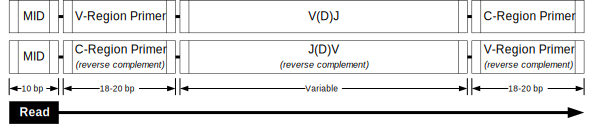
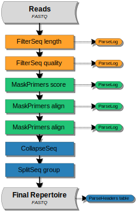

Roche 454 BCR mRNA with Multiplexed Samples
================================================================================

Overview of Experimental Data
--------------------------------------------------------------------------------

.. include:: ../../examples/Jiang2013/README.rst

Read Configuration
^^^^^^^^^^^^^^^^^^^^^^^^^^^^^^^^^^^^^^^^^^^^^^^^^^^^^^^^^^^^^^^^^^^^^^^^^^^^^^^^

    **Schematic of the Roche 454 read configuration.**
    The start of each sequences is labeled with the sample barcode.
    The following sequence may either be in the forward (top) orientation,
    proceeding 5' to 3' in the direction of the V(D)J reading frame, or the
    reverse complement orientation (bottom), proceeding in the opposite direction.

Example Data
^^^^^^^^^^^^^^^^^^^^^^^^^^^^^^^^^^^^^^^^^^^^^^^^^^^^^^^^^^^^^^^^^^^^^^^^^^^^^^^^

We have hosted a small subset of the data (Accession: SRR765688) on the
pRESTO website in FASTQ format, with accompanying primer and sample
barcode (MID) files. The sample data set and workflow script may be downloaded
from here:

`Jiang, He and Weinstein et al, 2013 Example Files <http://clip.med.yale.edu/immcantation/examples/Jiang2013_Example.tar.gz>`__

Overview of the Workflow
--------------------------------------------------------------------------------

The example that follows performs all processing steps to
arrive at high-quality unique sequences using this example data set. The
workflow is derived into three high level tasks:

    1. `Quality control`_
    2. `Sample barcode and primer identification`_
    3. `Deduplication and filtering`_

A graphical representation of the workflow along with the corresponding
sequence of pRESTO commands is shown below.

Flowchart
^^^^^^^^^^^^^^^^^^^^^^^^^^^^^^^^^^^^^^^^^^^^^^^^^^^^^^^^^^^^^^^^^^^^^^^^^^^^^^^^

    **Flowchart of processing steps.**
    Each pRESTO tool is shown as a colored box. The workflow is divided into
    three primary tasks: (orange) quality control, (green) sample barcode and primer
    identification, (blue) deduplication and filtering of the repertoire.
    Grey boxes indicate the initial and final data files. The intermediate
    files output by each tool are not shown for the sake of brevity.

Commands
^^^^^^^^^^^^^^^^^^^^^^^^^^^^^^^^^^^^^^^^^^^^^^^^^^^^^^^^^^^^^^^^^^^^^^^^^^^^^^^^

.. literalinclude:: scripts/Jiang2013_Commands.sh
   :language: none
   :linenos:
   :lineno-match:

:download:`Download Commands <scripts/Jiang2013_Commands.sh>`

Quality control
--------------------------------------------------------------------------------

The initial stage of the workflow involves two executions of the
:ref:`FilterSeq` tool. First, the :program:`length` subcommand is used to filter reads
which are too short to yield full V(D)J sequences using a liberal
minimum length requirement of 300 bp (:option:`-n 300 <FilterSeq length -n>`):

.. literalinclude:: scripts/Jiang2013_Commands.sh
   :language: none
   :linenos:
   :lineno-match:
   :lines: 2

Next, the :program:`quality` subcommand removes sequences having a mean Phred quality
score below 20 (:option:`-q 20 <FilterSeq quality -q>`).

.. literalinclude:: scripts/Jiang2013_Commands.sh
   :language: none
   :linenos:
   :lineno-match:
   :lines: 3

The :ref:`ParseLog` tool is then used to extract the results from the two
:ref:`FilterSeq` log files:

.. literalinclude:: scripts/Jiang2013_Commands.sh
   :language: none
   :linenos:
   :lineno-match:
   :lines: 17

To create two tab-delimited files containing the following results for each read:

===================== ===============================
Field                 Description
===================== ===============================
ID                    Sequence name
LENGTH                Sequence length
QUALITY               Quality score
===================== ===============================

Sample barcode and primer identification
--------------------------------------------------------------------------------

Annotation of sample barcodes
^^^^^^^^^^^^^^^^^^^^^^^^^^^^^^^^^^^^^^^^^^^^^^^^^^^^^^^^^^^^^^^^^^^^^^^^^^^^^^^^

Following the initial filtering steps, additional filtering is performed
with three iterations of the :ref:`MaskPrimers` tool based upon the presence of
recognized sample barcode (MID), forward primer, and reverse primer sequences.
As the orientation and position of the sample barcode is known, the
first pass through MaskPrimers uses the faster :program:`score` subcommand which
requires a fixed start position (:option:`--start 0 <MaskPrimers score --start>`)
and a low allowable error rate (:option:`--maxerror 0.1 <MaskPrimers score --maxerror>`).
The name of the MID will be annotated in the sequence header as the ``MID`` field
(:option:`--pf MID <MaskPrimers score --pf>`):

.. literalinclude:: scripts/Jiang2013_Commands.sh
   :language: none
   :linenos:
   :lineno-match:
   :lines: 4-6

Primer masking and annotation
^^^^^^^^^^^^^^^^^^^^^^^^^^^^^^^^^^^^^^^^^^^^^^^^^^^^^^^^^^^^^^^^^^^^^^^^^^^^^^^^

The next :ref:`MaskPrimers` task uses the :program:`align` subcommand to identify
both the start position of the V-segment primer and correct the orientation of the
sequence such that all reads are now oriented in the direction of the
V(D)J reading frame), as determined by the orientation of the V-segment primer match.
The name of the V-segment primer will be annotated in the sequence header as the
``VPRIMER`` field (:option:`--pf VPRIMER <MaskPrimers align --pf>`):

.. literalinclude:: scripts/Jiang2013_Commands.sh
   :language: none
   :linenos:
   :lineno-match:
   :lines: 7-9

The final MaskPrimers task locates the C-region primer, which is used for isotype
assignment of each read. As all sequences are assumed to have been
properly oriented by the second MaskPrimers task, the additional
arguments :option:`MaskPrimers align --revpr` and :option:`MaskPrimers align --skiprc`
are added to the third execution. The :option:`MaskPrimers align --revpr` argument
informs the tool that primers sequences should be reverse complemented prior to alignment,
and that a match should be searched for (and cut from) the tail end of the sequence.
The :option:`MaskPrimers align --skiprc` argument tells the tool to align against only
the forward sequence; meaning, it will not check primer matches against the reverse complement
sequence and it will not reorient sequences. The name of the C-region primer
will be annotated in the sequence header as the ``CPRIMER`` field
(:option:`--pf CPRIMER <MaskPrimers align --pf>`):

.. literalinclude:: scripts/Jiang2013_Commands.sh
   :language: none
   :linenos:
   :lineno-match:
   :lines: 10-12

At this stage, a table of primers and alignment error rates may be generated by executing ParseLog
on the log file of each :ref:`MaskPrimers` tasks:

.. literalinclude:: scripts/Jiang2013_Commands.sh
   :language: none
   :linenos:
   :lineno-match:
   :lines: 19

Which will contain the following information for each log file:

===================== ===============================
Field                 Description
===================== ===============================
ID                    Sequence name
PRIMER                Primer or sample barcode name
ERROR                 Primer match error rate
===================== ===============================

Deduplication and filtering
--------------------------------------------------------------------------------

Removal of duplicate sequences
^^^^^^^^^^^^^^^^^^^^^^^^^^^^^^^^^^^^^^^^^^^^^^^^^^^^^^^^^^^^^^^^^^^^^^^^^^^^^^^^

The final stage of the workflow involves two filtering steps to yield
unique sequences for each sample barcode. First, the set of unique
sequences is identified using the :ref:`CollapseSeq` tool, allowing for up to
20 interior N-valued positions
(:option:`-n 20 <CollapseSeq -n>` and :option:`--inner <CollapseSeq --inner>`), and
requiring that all reads considered duplicated share the same isotype
and sample barcode tag (:option:`--uf MID CPRIMER <CollapseSeq --uf>`).
Additionally, the V-region primer annotations of the set of duplicate reads are
propagated into the annotation of each retained unique sequence
(:option:`--cf VPRIMER <CollapseSeq --cf>` and :option:`--act set <CollapseSeq --act>`):

.. literalinclude:: scripts/Jiang2013_Commands.sh
   :language: none
   :linenos:
   :lineno-match:
   :lines: 13-14

Filtering to repeated sequences
^^^^^^^^^^^^^^^^^^^^^^^^^^^^^^^^^^^^^^^^^^^^^^^^^^^^^^^^^^^^^^^^^^^^^^^^^^^^^^^^

CollapseSeq stores the count of duplicate reads for each sequence in the
``DUPCOUNT`` annotation. Following duplicate removal, the data is subset
to only those unique sequence with at least two representative reads by
using the :program:`group` subcommand of :ref:`SplitSeq` on the count field
(:option:`-f DUPCOUNT <SplitSeq group -f>`) and specifying a numeric threshold
(:option:`--num 2 <SplitSeq group --num>`):

.. literalinclude:: scripts/Jiang2013_Commands.sh
   :language: none
   :linenos:
   :lineno-match:
   :lines: 15

Creating an annotation table
^^^^^^^^^^^^^^^^^^^^^^^^^^^^^^^^^^^^^^^^^^^^^^^^^^^^^^^^^^^^^^^^^^^^^^^^^^^^^^^^

Finally, the annotations, including the sample barcode (``MID``), duplicate read
count (``DUPCOUNT``), isotype (``CPRIMER``) and V-region primer (``VPRIMER``),
of the final repertoire are then extracted from the :ref:`SplitSeq` output into a
tab-delimited file using the :program:`table` subcommand of :ref:`ParseHeaders`:

.. literalinclude:: scripts/Jiang2013_Commands.sh
   :language: none
   :linenos:
   :lineno-match:
   :lines: 16

.. note::

   Optionally, you may split each sample into separate files using the ``MID``
   annotation and an alternate invocation of :ref:`SplitSeq`.  The :program:`group`
   subcommand may be used to split files on a categorical field, rather than a
   numerical field, by skipping the :option:`--num <SplitSeq group --num>` argument::

      SplitSeq.py group -s M1_collapse-unique.fastq -f MID

   Will split the unique sequence file into a set of separate files according the
   the valud in the ``MID`` field (:option:`-f MID <SplitSeq group -f>`), such that
   each file will contain sequences from only one sample.

Output files
--------------------------------------------------------------------------------

The final set of sequences, which serve as input to a V(D)J reference aligner
(Eg, IMGT/HighV-QUEST or IgBLAST), and tables that can be plotted for quality
control are:

=============================== ===============================
File                            Description
=============================== ===============================
S43_collapse-unique.fastq       Total unique sequences
S43_atleast-2.fastq             Unique sequences represented by at least 2 reads
S43_atleast-2_headers.tab       Annotation table of the atleast-2 file
FSL_table.tab                   Table of the FilterSeq-length log
FSQ_table.tab                   Table of the FilterSeq-quality log
MPM_table.tab                   Table of the MID MaskPrimers log
MPV_table.tab                   Table of the V-segment MaskPrimers log
MPC_table.tab                   Table of the C-region MaskPrimers log
=============================== ===============================

A number of other intermediate and log files are generated during the workflow,
which allows easy tracking/reversion of processing steps. These files are not
listed in the table above.

Performance
--------------------------------------------------------------------------------

Example performance statistics for a comparable, but larger, 454
workflow are presented below. Performance was measured
on a 64-core system with 2.3GHz AMD Opteron(TM) 6276 processors and
512GB of RAM, with memory usage measured at peak utilization. The data
set contained 1,346,039 raw reads, and required matching of 11 sample
barcodes, 11 V-segment primers, and 5 C-region primers.

.. csv-table::
   :file: tables/454_Jiang2013_Performance.tsv
   :delim: tab
   :header-rows: 1
   :widths: 10, 40, 20, 10, 10, 10
