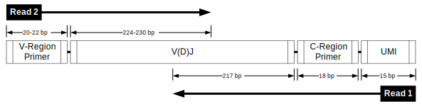
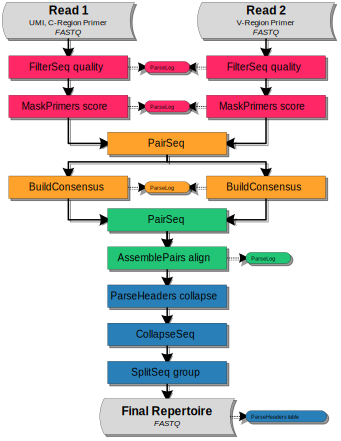

UMI Barcoded Illumina MiSeq 2x250 BCR mRNA
================================================================================

Overview of Experimental Data
--------------------------------------------------------------------------------

.. include:: ../../examples/Stern2014/README.rst

Read Configuration
^^^^^^^^^^^^^^^^^^^^^^^^^^^^^^^^^^^^^^^^^^^^^^^^^^^^^^^^^^^^^^^^^^^^^^^^^^^^^^^^

    **Schematic of the Illumina MiSeq 2x250 paired-end reads with UMI barcodes.**
    Each 250 base-pair read was sequenced from one end of the target cDNA, so
    that the two reads together cover the entire variable region of the Ig
    heavy chain. The V(D)J reading frame proceeds from the start of read 2 to
    the start of read 1. Read 1 is in the opposite orientation
    (reverse complement), and contains a 15 nucleotide UMI barcode preceding
    the C-region primer sequence.

Example Data
^^^^^^^^^^^^^^^^^^^^^^^^^^^^^^^^^^^^^^^^^^^^^^^^^^^^^^^^^^^^^^^^^^^^^^^^^^^^^^^^

We have hosted a small subset of the data (Accession: SRR1383456) on the
pRESTO website in FASTQ format with accompanying primer files. The sample data
set and workflow script may be downloaded from here:

`Stern, Yaari and Vander Heiden et al, 2014 Example Files <http://clip.med.yale.edu/immcantation/examples/Stern2014_Example.tar.gz>`__

Overview of the Workflow
--------------------------------------------------------------------------------

In the following sections, we demonstrate each step of the workflow to move
from raw sequence reads to a fully annotated repertoire of complete V(D)J
sequences. The workflow is divided into four high-level tasks:

    1. `Quality control, UMI annotation and primer masking`_
    2. `Generation of UMI consensus sequences`_
    3. `Paired-end assembly of UMI consensus sequences`_
    4. `Deduplication and filtering`_

A graphical representation of the workflow along with the corresponding
sequence of pRESTO commands is shown below.

Flowchart
^^^^^^^^^^^^^^^^^^^^^^^^^^^^^^^^^^^^^^^^^^^^^^^^^^^^^^^^^^^^^^^^^^^^^^^^^^^^^^^^

    **Flowchart of processing steps.**
    Each pRESTO tool is shown as a colored box. The workflow is divided into
    four primary tasks: (red) quality control, UMI annotation and primer masking;
    (orange) generation of UMI consensus sequences; (green) paired-end assembly of
    UMI consensus sequences; and (blue) deduplication and filtering to obtain the
    high-fidelity repertoire. Grey boxes indicate the initial and final data files.
    The intermediate files output by each tool are not shown for the sake of brevity.

Commands
^^^^^^^^^^^^^^^^^^^^^^^^^^^^^^^^^^^^^^^^^^^^^^^^^^^^^^^^^^^^^^^^^^^^^^^^^^^^^^^^

.. literalinclude:: scripts/Stern2014_Commands.sh
   :language: none
   :linenos:
   :lineno-match:

:download:`Download Commands <scripts/Stern2014_Commands.sh>`

Quality control, UMI annotation and primer masking
--------------------------------------------------------------------------------

Removal of low quality reads
^^^^^^^^^^^^^^^^^^^^^^^^^^^^^^^^^^^^^^^^^^^^^^^^^^^^^^^^^^^^^^^^^^^^^^^^^^^^^^^^

Quality control begins with the identification and removal of
low-quality reads using the :program:`quality` subcommand of the
:ref:`FilterSeq` tool. In this example, reads with mean Phred quality scores
less than 20 (:option:`-q 20 <FilterSeq quality -q>`) are removed:

.. literalinclude:: scripts/Stern2014_Commands.sh
   :language: none
   :linenos:
   :lineno-match:
   :lines: 2-3

The :ref:`ParseLog` tool is then used to extract results
from the :ref:`FilterSeq` logs into tab-delimited files:

.. literalinclude:: scripts/Stern2014_Commands.sh
   :language: none
   :linenos:
   :lineno-match:
   :lines: 24

Extracting the following information from the log:

===================== ===============================
Field                 Description
===================== ===============================
ID                    Sequence name
QUALITY               Quality score
===================== ===============================

UMI annotation and masking of primer regions
^^^^^^^^^^^^^^^^^^^^^^^^^^^^^^^^^^^^^^^^^^^^^^^^^^^^^^^^^^^^^^^^^^^^^^^^^^^^^^^^

Next, the :program:`score` subcommand of :ref:`MaskPrimers` is
used to identify and remove the PCR primers for both reads. When
dealing with Ig sequences, it is important to cut or mask the primers,
as B cell receptors are subject to somatic hypermutation (the
accumulation of point mutations in the DNA) and degenerate primer
matches can look like mutations in downstream applications. The
MaskPrimers tool is also used to annotate each read 1 sequence
with the 15 nucleotide UMI that precedes the C-region primer
(:option:`MaskPrimers score --barcode`):

.. literalinclude:: scripts/Stern2014_Commands.sh
   :language: none
   :linenos:
   :lineno-match:
   :lines: 4-7

To summarize these steps, the :ref:`ParseLog` tool is used to build a
tab-delimited file from the :ref:`MaskPrimers` log:

.. literalinclude:: scripts/Stern2014_Commands.sh
   :language: none
   :linenos:
   :lineno-match:
   :lines: 25

Containing the following information:

===================== ===============================
Field                 Description
===================== ===============================
ID                    Sequence name
PRIMER                Primer name
BARCODE               UMI sequence
ERROR                 Primer match error rate
===================== ===============================

.. note::

    For this data set the UMI is immediately upstream of the C-region primer.
    Another common approach for UMI barcoding involves placing the UMI
    immediately upstream of a 5'RACE template switch site. Modifying the
    workflow is simple for this case. You just need to replace the V-segment
    primers with a fasta file containing the TS sequences and move the
    :option:`--barcode <MaskPrimers score --barcode>` argument to the
    appropriate read::

        MaskPrimers.py score -s R1_quality-pass.fastq -p CPrimers.fasta \
            --start 0 --mode cut --outname R1 --log MP1.log
        MaskPrimers.py score -s R2_quality-pass.fastq -p TSSites.fasta \
            --start 17 --barcode --mode cut --maxerror 0.5 \
            --outname R2 --log MP2.log

    In the above we have moved the UMI annotation to read 2, increased
    the allowable error rate for matching the TS site
    (:option:`--maxerror 0.5 <MaskPrimers score --maxerror>`),
    cut the TS site (:option:`--mode cut <MaskPrimers score --mode>`),
    and increased the size of the UMI from 15 to 17 nucleotides
    (:option:`--start 17 <MaskPrimers score --start>`).

Generation of UMI consensus sequences
--------------------------------------------------------------------------------

.. _Stern2014-PairSeq-1:

Copying the UMI annotation across paired-end files
^^^^^^^^^^^^^^^^^^^^^^^^^^^^^^^^^^^^^^^^^^^^^^^^^^^^^^^^^^^^^^^^^^^^^^^^^^^^^^^^

In this task, a single consensus sequence is constructed for each set of
reads annotated with the same UMI barcode. As the UMI barcode is part of
read 1, the ``BARCODE`` annotation identified by :ref:`MaskPrimers` must
first be copied to the read 2 mate-pair of each read 1
sequence. Propogation of annotations between mate pairs is performed
using :ref:`PairSeq` which also removes
unpaired reads and ensures that paired reads are sorted in the same
order across files:

.. literalinclude:: scripts/Stern2014_Commands.sh
   :language: none
   :linenos:
   :lineno-match:
   :lines: 8-9

.. note::

    For both the :ref:`PairSeq` and :ref:`AssemblePairs` commands using the
    correct :option:`--coord <PairSeq --coord>` argument is critical
    for matching mate-pairs. If this was raw data from Illumina, rather than
    data downloaded from SRA/ENA, then the appropriate argument would be
    :option:`--coord illumina <PairSeq --coord>`.

.. note::

    If you have followed the 5'RACE modification above, then you must also
    modify the first :ref:`PairSeq` step to copy the UMI from read 2 to read 1,
    instead of vice versa (:option:`--2f BARCODE <PairSeq --2f>`)::

        PairSeq.py -1 R1_primers-pass.fastq -2 R2_primers-pass.fastq \
            --2f BARCODE --coord sra

Multiple alignment of UMI read groups
^^^^^^^^^^^^^^^^^^^^^^^^^^^^^^^^^^^^^^^^^^^^^^^^^^^^^^^^^^^^^^^^^^^^^^^^^^^^^^^^

Before generating a consensus for a set of reads sharing a UMI barcode,
the sequences must be properly aligned. Sequences may not be aligned if
more than one PCR primer is identified in a UMI read group - leading to
variations in the the start positions of the reads. Ideally, each set of
reads originating from a single mRNA molecule should be amplified with
the same primer. However, different primers in the multiplex pool may be
incorporated into the same UMI read group during amplification if the
primers are sufficiently similar. This type of primer misalignment can
be corrected using the :ref:`AlignSets` tool. In the example data used here,
this step was not necessary due to the aligned primer design for the 45
V-segment primers, though this does require that the V-segment primers be
masked, rather than cut, during the :ref:`MaskPrimers` step
(:option:`--mode mask <MaskPrimers score --mode>`).

.. seealso::

    If your data requires alignment, then you can create multiple aligned UMI read
    groups as follows::

        AlignSets.py muscle -s R1_primers-pass_pair-pass.fastq --bf BARCODE \
            --exec ~/bin/muscle --outname R1 --log AS1.log
        AlignSets.py muscle -s R2_primers-pass_pair-pass.fastq --bf BARCODE \
            --exec ~/bin/muscle --outname R2 --log AS2.log

    Where the :option:`--bf BARCODE <AlignSets muscle --bf>` defines the field
    containing the UMI and :option:`--exec ~/bin/muscle <AlignSets muscle --exec>`
    is the location of the :program:`MUSCLE` executable.

    For additional details see the section on :ref:`fixing UMI alignments <UMI-Alignment>`.

Generating UMI consensus reads
^^^^^^^^^^^^^^^^^^^^^^^^^^^^^^^^^^^^^^^^^^^^^^^^^^^^^^^^^^^^^^^^^^^^^^^^^^^^^^^^

After alignment, a single consensus sequence is generated for each UMI
barcode using :ref:`BuildConsensus`:

.. literalinclude:: scripts/Stern2014_Commands.sh
   :language: none
   :linenos:
   :lineno-match:
   :lines: 10-13

To correct for UMI chemistry and sequencing errors, UMI read groups having
high error statistics (mismatch rate from consensus) are removed by
specifiying the :option:`--maxerror 0.1 <BuildConsensus --maxerror>`
threshold. As the accuracy of the primer assignment in read 1 is critical
for correct isotype identification, additional filtering of read 1 is carried out
during this step. Specifying the :option:`--prcons 0.6 <BuildConsensus --prcons>`
threshold: (a) removes individual sequences that do not share a common primer annotation with
the majority of the set, (b) removes entire read groups which have
ambiguous primer assignments, and (c) constructs a consensus primer
assignment for each UMI.

.. note::

    The :option:`--maxgap 0.5 <BuildConsensus --maxgap>` argument tells
    :ref:`BuildConsensus` to use a majority rule to delete any gap positions
    which occur in more than 50% of the reads. The :option:`--maxgap <BuildConsensus --maxgap>`
    argument is not really necessary for this example data set as we did not perform
    a multiple alignment of the UMI read groups. However, if you have performed an
    alignment, then use of :option:`--maxgap <BuildConsensus --maxgap>` during consensus
    generation is highly recommended.

The :ref:`ParseLog` tool is then used to build a tab-delimited file contain
the consensus results:

.. literalinclude:: scripts/Stern2014_Commands.sh
   :language: none
   :linenos:
   :lineno-match:
   :lines: 26

With the following annotations:

===================== ===============================
Field                 Description
===================== ===============================
BARCODE               UMI sequence
SEQCOUNT              Number of total reads in the UMI group
CONSCOUNT             Number of reads used for the UMI consensus
PRIMER                Set of primer names in the UMI group
PRCONS                Consensus primer name
PRCOUNT               Count of primers in the UMI group
PRFREQ                Frequency of primers in the UMI group
ERROR                 Average mismatch rate from consensus
===================== ===============================

Paired-end assembly of UMI consensus sequences
--------------------------------------------------------------------------------

Syncronizing paired-end files
^^^^^^^^^^^^^^^^^^^^^^^^^^^^^^^^^^^^^^^^^^^^^^^^^^^^^^^^^^^^^^^^^^^^^^^^^^^^^^^^

Following UMI consensus generation, the read 1 and read 2 files may
again be out of sync due to differences in UMI read group filtering by
:ref:`BuildConsensus`. To synchronize the reads another instance of :ref:`PairSeq`
must be run, but without any annotation manipulation:

.. literalinclude:: scripts/Stern2014_Commands.sh
   :language: none
   :linenos:
   :lineno-match:
   :lines: 14-15

Assembling UMI consensus mate-pairs
^^^^^^^^^^^^^^^^^^^^^^^^^^^^^^^^^^^^^^^^^^^^^^^^^^^^^^^^^^^^^^^^^^^^^^^^^^^^^^^^

Once the files have been synchronized, each paired-end UMI consensus
sequence is assembled into a full length Ig sequence using the
:program:`align` subcommand of :ref:`AssemblePairs`:

.. literalinclude:: scripts/Stern2014_Commands.sh
   :language: none
   :linenos:
   :lineno-match:
   :lines: 16-18

During assembly, the consensus isotype annotation (``PRCONS``) from read 1
and the number of reads used to define the consensus sequence (``CONSCOUNT``)
for both reads are propagated into the annotations of the full length Ig sequence
(:option:`--1f CONSCOUNT --2f CONSCOUNT PRCONS <AssemblePairs align --1f>`.

:ref:`ParseLog` is then uses to extract the results from the :ref:`AssemblePairs`
log into a tab-delimited file:

.. literalinclude:: scripts/Stern2014_Commands.sh
   :language: none
   :linenos:
   :lineno-match:
   :lines: 27

Containing the following information:

===================== ===============================
Field                 Description
===================== ===============================
ID                    Sequence name (UMI)
LENGTH                Length of the assembled sequence
OVERLAP               Length of the overlap between mate-pairs
ERROR                 Mismatch rate of the overlapping region
PVALUE                P-value for the assembly
FIELDS1               Annotations copied from read 2 into the assembled sequence
FIELDS2               Annotations copied from read 1 into the assembled sequence
===================== ===============================

.. seealso::

    Depending on the amplicon length in your data, not all mate-pairs may overlap.
    For the sake of simplicity, we have excluded a demonstration of assembly
    in such cases. pRESTO provides a couple approaches to deal with such reads.
    The :program:`reference` subcommand of :ref:`AssemblePairs` can use the
    ungapped V-segment reference sequences to properly space non-overlapping reads.
    Or, if all else fails, the :program:`join` subcommand can be used to simply
    stick mate-pairs together end-to-end with some intervening gap.

Deduplication and filtering
--------------------------------------------------------------------------------

Combining UMI read group size annotations
^^^^^^^^^^^^^^^^^^^^^^^^^^^^^^^^^^^^^^^^^^^^^^^^^^^^^^^^^^^^^^^^^^^^^^^^^^^^^^^^

In the final stage of the workflow, the high-fidelity Ig repertoire is
obtained by a series of filtering steps. First, the annotation
specifying the number of raw reads used to build each sequence
(:option:`-f CONSCOUNT <ParseHeaders collapse -f>`) is updated to be the
minimum (:option:`--act min <ParseHeaders collapse --act>`) of the
forward and reverse reads using the
:program:`collapse` subcommand of :ref:`ParseHeaders`:

.. literalinclude:: scripts/Stern2014_Commands.sh
   :language: none
   :linenos:
   :lineno-match:
   :lines: 19

Removal of duplicate sequences
^^^^^^^^^^^^^^^^^^^^^^^^^^^^^^^^^^^^^^^^^^^^^^^^^^^^^^^^^^^^^^^^^^^^^^^^^^^^^^^^

Second, duplicate nucleotide sequences are removed using the :ref:`CollapseSeq`
tool with the requirement that duplicate sequences share the same
isotype primer (:option:`--uf PRCONS <CollapseSeq --uf>`). The duplicate removal
step also removes sequences with a high number of interior N-valued nucleotides
(:option:`-n 20 <CollapseSeq -n>` and :option:`--inner <CollapseSeq --inner>`)
and combines the read counts for each UMI read group
(:option:`--cf CONSCOUNT <CollapseSeq --cf>` and :option:`--act sum <CollapseSeq --act>`).

.. literalinclude:: scripts/Stern2014_Commands.sh
   :language: none
   :linenos:
   :lineno-match:
   :lines: 20-21

Filtering to sequences with at least two representative reads
^^^^^^^^^^^^^^^^^^^^^^^^^^^^^^^^^^^^^^^^^^^^^^^^^^^^^^^^^^^^^^^^^^^^^^^^^^^^^^^^

Finally, unique sequences are filtered to those with at least 2
contributing sequences using the :program:`group` subcommand of :ref:`SplitSeq`,
by splitting the file on the ``CONSCOUNT`` annotation with a numeric threshold
(:option:`-f CONSCOUNT <SplitSeq group -f>` and :option:`--num 2 <SplitSeq group --num>`):

.. literalinclude:: scripts/Stern2014_Commands.sh
   :language: none
   :linenos:
   :lineno-match:
   :lines: 22

Creating an annotation table
^^^^^^^^^^^^^^^^^^^^^^^^^^^^^^^^^^^^^^^^^^^^^^^^^^^^^^^^^^^^^^^^^^^^^^^^^^^^^^^^

For further analysis, the annotations of the final repertoire are then converted to
into a table using the :program:`table` subcommand of :ref:`ParseHeaders`:

.. literalinclude:: scripts/Stern2014_Commands.sh
   :language: none
   :linenos:
   :lineno-match:
   :lines: 23

Output files
--------------------------------------------------------------------------------

The final set of sequences, which serve as input to a V(D)J reference aligner
(Eg, IMGT/HighV-QUEST or IgBLAST), and tables that can be plotted for quality
control are:

=============================== ===============================
File                            Description
=============================== ===============================
M12_collapse-unique.fastq       Total unique sequences
M12_atleast-2.fastq             Unique sequences represented by at least 2 reads
M12_atleast-2_headers.tab       Annotation table of the atleast-2 file
FS1_table.tab                   Table of the read 1 FilterSeq log
FS2_table.tab                   Table of the read 2 FilterSeq log
MP1_table.tab                   Table of the C-region MaskPrimers log
MP2_table.tab                   Table of the V-segment MaskPrimers log
BC1_table.tab                   Table of the read 1 BuildConsensus log
BC2_table.tab                   Table of the read 2 BuildConsensus log
AP_table.tab                    Table of the AssemblePairs log
=============================== ===============================

A number of other intermediate and log files are generated during the workflow,
which allows easy tracking/reversion of processing steps. These files are not
listed in the table above.

Performance
--------------------------------------------------------------------------------

Example performance statistics for a comparable, but larger, MiSeq
workflow are presented below. Performance was measured
on a 64-core system with 2.3GHz AMD Opteron(TM) 6276 processors and
512GB of RAM, with memory usage measured at peak utilization. The data
set contained 1,723,558 x 2 raw reads, and required
matching of 1 C-region primer, 45 V-segment
primers, and averaged 24.3 reads per UMI.

.. csv-table::
   :file: tables/MiSeq_Stern2014_Performance.tsv
   :delim: tab
   :header-rows: 1
   :widths: 10, 40, 20, 10, 10, 10

