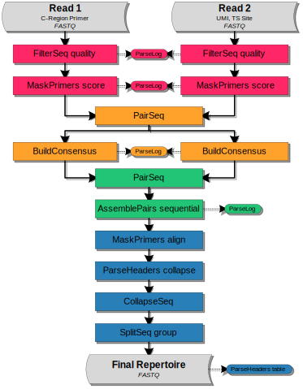

UMI Barcoded Illumina MiSeq 325+275 paired-end 5'RACE BCR mRNA
================================================================================

Overview of Experimental Data
--------------------------------------------------------------------------------

.. include:: ../../examples/VanderHeiden2017/README.rst

Read Configuration
^^^^^^^^^^^^^^^^^^^^^^^^^^^^^^^^^^^^^^^^^^^^^^^^^^^^^^^^^^^^^^^^^^^^^^^^^^^^^^^^

    **Schematic of the Illumina MiSeq 325+275 paired-end reads with UMI barcodes.**
    Each read was sequenced from one end of the target cDNA so that the two reads
    together cover the entire variable region of the Ig heavy chain. Sequencing was
    performed using an uneven number of cycles for read 1 and read 2 using a 2x300 kit.
    The V(D)J reading frame proceeds from the start of read 2 to the start of read 1.
    Read 1 is in the opposite orientation (reverse complement), contains a partial C-region,
    and is 325 nucleotides in length. Read 2 contains the 5'RACE template switch site
    with a 17 nucleotide UMI barcode preceding it, and is 275 nucleotides in length.

Example Data
^^^^^^^^^^^^^^^^^^^^^^^^^^^^^^^^^^^^^^^^^^^^^^^^^^^^^^^^^^^^^^^^^^^^^^^^^^^^^^^^

We have hosted a small subset of the data (Accession: SRR1383456) on the
pRESTO website in FASTQ format with accompanying primer files. The sample data
set and workflow script may be downloaded from here:

`Vander Heiden et al, 2017 Example Files <http://clip.med.yale.edu/immcantation/examples/VanderHeiden2017_Example.tar.gz>`__

Overview of the Workflow
--------------------------------------------------------------------------------

In the following sections, we demonstrate each step of the workflow to move
from raw sequence reads to a fully annotated repertoire of complete V(D)J
sequences. The workflow is divided into four high-level tasks:

    1. `Quality control, UMI annotation and primer masking`_
    2. `Generation of UMI consensus sequences`_
    3. `Paired-end assembly of UMI consensus sequences`_
    4. `Deduplication and filtering`_

A graphical representation of the workflow along with the corresponding
sequence of pRESTO commands is shown below.

Flowchart
^^^^^^^^^^^^^^^^^^^^^^^^^^^^^^^^^^^^^^^^^^^^^^^^^^^^^^^^^^^^^^^^^^^^^^^^^^^^^^^^

    **Flowchart of processing steps.**
    Each pRESTO tool is shown as a colored box. The workflow is divided into
    four primary tasks: (red) quality control, UMI annotation and primer masking;
    (orange) generation of UMI consensus sequences; (green) paired-end assembly of
    UMI consensus sequences; and (blue) deduplication and filtering to obtain the
    high-fidelity repertoire. Grey boxes indicate the initial and final data files.
    The intermediate files output by each tool are not shown for the sake of brevity.

Commands
^^^^^^^^^^^^^^^^^^^^^^^^^^^^^^^^^^^^^^^^^^^^^^^^^^^^^^^^^^^^^^^^^^^^^^^^^^^^^^^^

.. literalinclude:: scripts/VanderHeiden2017_Commands.sh
   :language: none
   :linenos:
   :lineno-match:

:download:`Download Commands <scripts/VanderHeiden2017_Commands.sh>`

Quality control, UMI annotation and primer masking
--------------------------------------------------------------------------------

Removal of low quality reads
^^^^^^^^^^^^^^^^^^^^^^^^^^^^^^^^^^^^^^^^^^^^^^^^^^^^^^^^^^^^^^^^^^^^^^^^^^^^^^^^

Quality control begins with the identification and removal of
low-quality reads using the :program:`quality` subcommand of the
:ref:`FilterSeq` tool. In this example, reads with mean Phred quality scores
less than 20 (:option:`-q 20 <FilterSeq quality -q>`) are removed:

.. literalinclude:: scripts/VanderHeiden2017_Commands.sh
   :language: none
   :linenos:
   :lineno-match:
   :lines: 2-3

The :ref:`ParseLog` tool is then used to extract results
from the :ref:`FilterSeq` logs into tab-delimited files:

.. literalinclude:: scripts/VanderHeiden2017_Commands.sh
   :language: none
   :linenos:
   :lineno-match:
   :lines: 29

Extracting the following information from the log:

===================== ===============================
Field                 Description
===================== ===============================
ID                    Sequence name
QUALITY               Quality score
===================== ===============================

UMI annotation and removal of primer regions
^^^^^^^^^^^^^^^^^^^^^^^^^^^^^^^^^^^^^^^^^^^^^^^^^^^^^^^^^^^^^^^^^^^^^^^^^^^^^^^^

Next, the :program:`score` subcommand of :ref:`MaskPrimers` is
used to identify and remove the PCR primers for both reads. When
dealing with Ig sequences, it is important to cut or mask the primers,
as B cell receptors are subject to somatic hypermutation (the
accumulation of point mutations in the DNA) and degenerate primer
matches can look like mutations in downstream applications. The
MaskPrimers tool is also used to annotate each read 2 sequence
with the 17 nucleotide UMI that precedes the template switch site.
(:option:`MaskPrimers score --barcode`):

.. literalinclude:: scripts/VanderHeiden2017_Commands.sh
   :language: none
   :linenos:
   :lineno-match:
   :lines: 4-7

To summarize these steps, the :ref:`ParseLog` tool is used to build a
tab-delimited file from the :ref:`MaskPrimers` log:

.. literalinclude:: scripts/VanderHeiden2017_Commands.sh
   :language: none
   :linenos:
   :lineno-match:
   :lines: 30

Containing the following information:

===================== ===============================
Field                 Description
===================== ===============================
ID                    Sequence name
PRIMER                Primer name
BARCODE               UMI sequence
ERROR                 Primer match error rate
===================== ===============================

.. note::

    For this data, we are using the 5'RACE template switch sequences
    as proxy primers. We've set the match error rate extremely high
    (:option:`--maxerror 0.5 <MaskPrimers score --maxerror>`)
    because an accurate match isn't important. Mostly, we are just concerned
    with extracting the UMI barcode that precedes the template switch site.

Generation of UMI consensus sequences
--------------------------------------------------------------------------------

.. _VanderHeiden2017-PairSeq-1:

Copying the UMI annotation across paired-end files
^^^^^^^^^^^^^^^^^^^^^^^^^^^^^^^^^^^^^^^^^^^^^^^^^^^^^^^^^^^^^^^^^^^^^^^^^^^^^^^^

In this task, a single consensus sequence is constructed for each set of
reads annotated with the same UMI barcode. As the UMI barcode is part of
read 2, the ``BARCODE`` annotation identified by :ref:`MaskPrimers` must
first be copied to the read 1 mate-pair of each read 2
sequence. Propogation of annotations between mate pairs is performed
using :ref:`PairSeq` which also removes
unpaired reads and ensures that paired reads are sorted in the same
order across files:

.. literalinclude:: scripts/VanderHeiden2017_Commands.sh
   :language: none
   :linenos:
   :lineno-match:
   :lines: 8-9

.. note::

    For both the :ref:`PairSeq` and :ref:`AssemblePairs` commands using the
    correct :option:`--coord <PairSeq --coord>` argument is critical
    for matching mate-pairs. If this was raw data from Illumina, rather than
    data downloaded from SRA, then the appropriate argument would be
    :option:`--coord illumina <PairSeq --coord>`.

Multiple alignment of UMI read groups
^^^^^^^^^^^^^^^^^^^^^^^^^^^^^^^^^^^^^^^^^^^^^^^^^^^^^^^^^^^^^^^^^^^^^^^^^^^^^^^^

Before generating a consensus for a set of reads sharing a UMI barcode,
the sequences must be properly aligned. Sequences may not be aligned if
more than one PCR primer is identified in a UMI read group - leading to
variations in the the start positions of the reads. Ideally, each set of
reads originating from a single mRNA molecule should be amplified with
the same primer. However, different primers in the multiplex pool may be
incorporated into the same UMI read group during amplification if the
primers are sufficiently similar. This type of primer misalignment can
be corrected using the :ref:`AlignSets` tool.

This step is not required for this data, but if necessary for your data
see the section on :ref:`fixing UMI problems <UMI-Alignment>`.

Generating UMI consensus reads
^^^^^^^^^^^^^^^^^^^^^^^^^^^^^^^^^^^^^^^^^^^^^^^^^^^^^^^^^^^^^^^^^^^^^^^^^^^^^^^^

After alignment, a single consensus sequence is generated for each UMI
barcode using :ref:`BuildConsensus`:

.. literalinclude:: scripts/VanderHeiden2017_Commands.sh
   :language: none
   :linenos:
   :lineno-match:
   :lines: 10-13

To correct for UMI chemistry and sequencing errors, UMI read groups having
high error statistics (mismatch rate from consensus) are removed by
specifiying the :option:`--maxerror 0.1 <BuildConsensus --maxerror>`
threshold. Additional filtering of read 1 is carried out
during this step by specifying the :option:`--prcons 0.6 <BuildConsensus --prcons>`
threshold which: (a) removes individual sequences that do not share a common primer annotation with
the majority of the set, (b) removes entire read groups which have
ambiguous primer assignments, and (c) constructs a consensus primer
assignment for each UMI.

.. note::

    The :option:`--maxgap 0.5 <BuildConsensus --maxgap>` argument tells
    :ref:`BuildConsensus` to use a majority rule to delete any gap positions
    which occur in more than 50% of the reads. The :option:`--maxgap <BuildConsensus --maxgap>`
    argument is not really necessary for this example data set as we did not perform
    a multiple alignment of the UMI read groups. However, if you have performed an
    alignment, then use of :option:`--maxgap <BuildConsensus --maxgap>` during consensus
    generation is highly recommended.

The :ref:`ParseLog` tool is then used to build a tab-delimited file contain
the consensus results:

.. literalinclude:: scripts/VanderHeiden2017_Commands.sh
   :language: none
   :linenos:
   :lineno-match:
   :lines: 31

With the following annotations:

===================== ===============================
Field                 Description
===================== ===============================
BARCODE               UMI sequence
SEQCOUNT              Number of total reads in the UMI group
CONSCOUNT             Number of reads used for the UMI consensus
PRCONS                Consensus primer name
PRFREQ                Frequency of primers in the UMI group
ERROR                 Average mismatch rate from consensus
===================== ===============================

Paired-end assembly of UMI consensus sequences
--------------------------------------------------------------------------------

Syncronizing paired-end files
^^^^^^^^^^^^^^^^^^^^^^^^^^^^^^^^^^^^^^^^^^^^^^^^^^^^^^^^^^^^^^^^^^^^^^^^^^^^^^^^

Following UMI consensus generation, the read 1 and read 2 files may
again be out of sync due to differences in UMI read group filtering by
:ref:`BuildConsensus`. To synchronize the reads another instance of :ref:`PairSeq`
must be run, but without any annotation manipulation:

.. literalinclude:: scripts/VanderHeiden2017_Commands.sh
   :language: none
   :linenos:
   :lineno-match:
   :lines: 14-15

Assembling UMI consensus mate-pairs
^^^^^^^^^^^^^^^^^^^^^^^^^^^^^^^^^^^^^^^^^^^^^^^^^^^^^^^^^^^^^^^^^^^^^^^^^^^^^^^^

Once the files have been synchronized, each paired-end UMI consensus
sequence is assembled into a full length Ig sequence using the
:program:`sequential` subcommand of :ref:`AssemblePairs`.
5'RACE creates long amplicons which are not guaranteed to overlap when sequenced
using a 2x300 kit. The :program:`sequential` subcommand will first attempt de
novo paired-end assembly. If that approach fails, it will attempt assembly guided
by the V segment reference sequences specified by the
:option:`-r <AssemblePairs sequential -r>` argument. Mate-pairs that fail to
overlap can thus be assembled, with the full length sequence containing an
appropriate number of intervening between the two reads.

.. literalinclude:: scripts/VanderHeiden2017_Commands.sh
   :language: none
   :linenos:
   :lineno-match:
   :lines: 16-19

During assembly, the consensus primer annotation (``PRCONS``) from read 1
and the number of reads used to define the consensus sequence (``CONSCOUNT``)
for both reads are propagated into the annotations of the full length Ig sequence
(:option:`--1f CONSCOUNT --2f CONSCOUNT PRCONS <AssemblePairs align --1f>`.

:ref:`ParseLog` is then uses to extract the results from the :ref:`AssemblePairs`
log into a tab-delimited file:

.. literalinclude:: scripts/VanderHeiden2017_Commands.sh
   :language: none
   :linenos:
   :lineno-match:
   :lines: 32

Containing the following information:

ID REFID LENGTH OVERLAP GAP ERROR IDENTITY

===================== ===============================
Field                 Description
===================== ===============================
ID                    Sequence name (UMI)
REFID                 The reference sequence name for reference guided assembly
LENGTH                Length of the assembled sequence
OVERLAP               Length of the overlap between mate-pairs
GAP                   Length of the gap between mate-pairs
ERROR                 Mismatch rate of the overlapping region from de novo assembly
IDENTITY              Identity score for the aligned region in reference guided assembly
===================== ===============================

Deduplication and filtering
--------------------------------------------------------------------------------

Annotating sequences with the constant region
^^^^^^^^^^^^^^^^^^^^^^^^^^^^^^^^^^^^^^^^^^^^^^^^^^^^^^^^^^^^^^^^^^^^^^^^^^^^^^^^

In the final stage of the workflow, the high-fidelity Ig repertoire is
obtained by a series of filtering steps. First, an additional annotation
defining the constant region is added to each sequence by aligning against
the constant region sequence internal to the primer. This step is not strictly
necessary, as the constant region primer is usually sufficient for isotype calls.
However, primer calls may be inaccurate with some primer sets, so this additional
confirmatory step is beneficial.

Internal constant regions are assigned using the :program:`align` subcommand
of :ref:`MaskPrimers` with a set of manually constructed sequences as the
"primers" (:option:`-p AbSeq_Human_IG_InternalCRegion.fasta <MaskPrimers align -p>`):

.. literalinclude:: scripts/VanderHeiden2017_Commands.sh
   :language: none
   :linenos:
   :lineno-match:
   :lines: 20-22

Here we use a high error rate for the match
(:option:`--maxerror 0.3 <MaskPrimers align --maxerror>`), restrict the match
to 100 nucleotides at the end of the sequence
(:option:`--maxlen 100 --revpr --skiprc <MaskPrimers align --maxlen>`), and
use mode the argument :option:`--mode tag <MaskPrimers align --mode>` to specify
that the input sequence should not be modified. The aligned C-region name
will be added to each sequence headers in the ``CREGION`` field
(:option:`--pf CREGION <MaskPrimers align --pf>`):

Combining UMI read group size annotations
^^^^^^^^^^^^^^^^^^^^^^^^^^^^^^^^^^^^^^^^^^^^^^^^^^^^^^^^^^^^^^^^^^^^^^^^^^^^^^^^

The annotation specifying the number of raw reads used to build each sequence
(:option:`-f CONSCOUNT <ParseHeaders collapse -f>`) is updated to be the
minimum (:option:`--act min <ParseHeaders collapse --act>`) of the
forward and reverse reads using the
:program:`collapse` subcommand of :ref:`ParseHeaders`:

.. literalinclude:: scripts/VanderHeiden2017_Commands.sh
   :language: none
   :linenos:
   :lineno-match:
   :lines: 23

Removal of duplicate sequences
^^^^^^^^^^^^^^^^^^^^^^^^^^^^^^^^^^^^^^^^^^^^^^^^^^^^^^^^^^^^^^^^^^^^^^^^^^^^^^^^

Second, duplicate nucleotide sequences are removed using the :ref:`CollapseSeq`
tool with the requirement that duplicate sequences share the same
constant region annotation (:option:`--uf CREGION <CollapseSeq --uf>`). The duplicate removal
step also removes sequences with a high number of interior N-valued nucleotides
(:option:`-n 20 <CollapseSeq -n>` and :option:`--inner <CollapseSeq --inner>`)
and combines the read counts for each UMI read group
(:option:`--cf CONSCOUNT <CollapseSeq --cf>` and :option:`--act sum <CollapseSeq --act>`).

.. literalinclude:: scripts/VanderHeiden2017_Commands.sh
   :language: none
   :linenos:
   :lineno-match:
   :lines: 24-25

Filtering to sequences with at least two representative reads
^^^^^^^^^^^^^^^^^^^^^^^^^^^^^^^^^^^^^^^^^^^^^^^^^^^^^^^^^^^^^^^^^^^^^^^^^^^^^^^^

Finally, unique sequences are filtered to those with at least 2
contributing sequences using the :program:`group` subcommand of :ref:`SplitSeq`,
by splitting the file on the ``CONSCOUNT`` annotation with a numeric threshold
(:option:`-f CONSCOUNT <SplitSeq group -f>` and :option:`--num 2 <SplitSeq group --num>`):

.. literalinclude:: scripts/VanderHeiden2017_Commands.sh
   :language: none
   :linenos:
   :lineno-match:
   :lines: 26-27

Creating an annotation table
^^^^^^^^^^^^^^^^^^^^^^^^^^^^^^^^^^^^^^^^^^^^^^^^^^^^^^^^^^^^^^^^^^^^^^^^^^^^^^^^

For further analysis, the annotations of the final repertoire are then converted to
into a table using the :program:`table` subcommand of :ref:`ParseHeaders`:

.. literalinclude:: scripts/VanderHeiden2017_Commands.sh
   :language: none
   :linenos:
   :lineno-match:
   :lines: 28

Output files
--------------------------------------------------------------------------------

The final set of sequences, which serve as input to a V(D)J reference aligner
(Eg, IMGT/HighV-QUEST or IgBLAST), and tables that can be plotted for quality
control are:

================================= ===============================
File                              Description
================================= ===============================
HD09N-C_collapse-unique.fastq     Total unique sequences
HD09N-C_atleast-2.fastq           Unique sequences represented by at least 2 reads
HD09N-C_atleast-2_headers.tab     Annotation table of the atleast-2 file
FS1_table.tab                     Table of the read 1 FilterSeq log
FS2_table.tab                     Table of the read 2 FilterSeq log
MP1_table.tab                     Table of the C-region primer MaskPrimers log
MP2_table.tab                     Table of the TS site MaskPrimers log
MP3_table.tab                     Table of the internal C-region MaskPrimers log
BC1_table.tab                     Table of the read 1 BuildConsensus log
BC2_table.tab                     Table of the read 2 BuildConsensus log
AP_table.tab                      Table of the AssemblePairs log
================================= ===============================

A number of other intermediate and log files are generated during the workflow,
which allows easy tracking/reversion of processing steps. These files are not
listed in the table above.